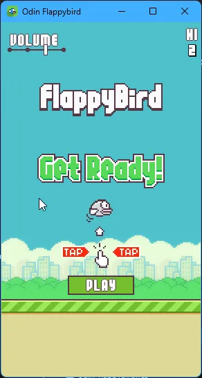

# Odin Flappybird

Flappybird written in Odin + Raylib 

## Screenshot / Demo

## TODO
> See current status in [TODO.md](./TODO.md)

## Running
### From Release
- Go to [Releases](https://github.com/ssebs/odin-flappybird/releases/)
- Download the version for your platform (only Windows is compiled atm)

<!-- TODO: see `odin build . -target:"?"` -->

### From Source
- [Install Odin](https://odin-lang.org/docs/install/)
- Clone this repo
- Run:
  - `odin run .` (or `make run`)
- Build:
  - `make build-[platform]`
  - > See [Makefile](./Makefile)

## SaveGame
The high score & volume setting is saved at:
- Windows: `%localappdata%\odin-flappybird-save.ini`
- [Other platforms look here](https://pkg.odin-lang.org/core/os/#user_data_dir)

## LICENSE
- This repo / game [Apache 2.0](./LICENSE)
- The assets: https://github.com/samuelcust/flappy-bird-assets

## Docs
- [Odin Lang Overview](https://odin-lang.org/docs/overview/)
- [odin raylib](https://pkg.odin-lang.org/vendor/raylib/#InitWindow)
- [odin core](https://pkg.odin-lang.org/core/strings/#to_cstring)
- [raylib examples](https://www.raylib.com/examples.html)
- [Box2D for collision](https://box2d.org/documentation/md_collision.html#autotoc_md36)
- [odin tetris](https://github.com/odin-lang/examples/blob/master/raylib/tetroid/raylib_tetroid.odin)
